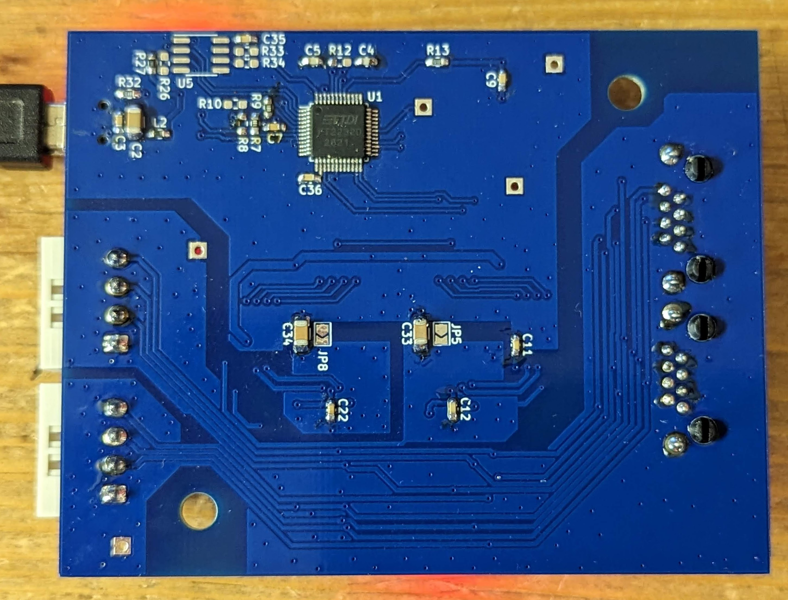
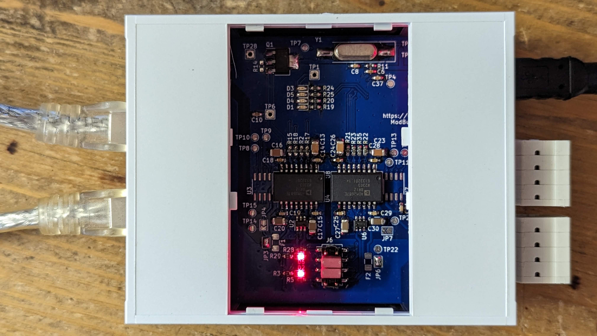

# Modbus-RJ45-Breakout
A breakout board for Dual-ModBus-over-Twisted-Pair (RJ45) with isolated converters option

Here are some images of the first prototype, assembled with isolating RS485 transceivers. Echo already works, real testing on a ModBus will take place soon.

